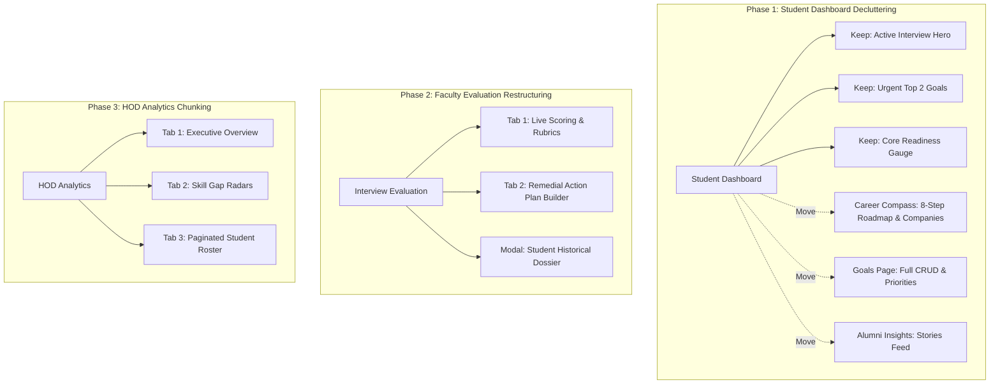

# Full UX/UI Audit & Restructuring Blueprint
**Project:** GRIP — Campus to Career Readiness Platform  
**Audit Environment:** Chrome/Chromium Headless via Playwright on Local Server (`http://localhost:5173`)  
**Backend:** Node.js / Express API (`http://localhost:5000`) with MongoDB  
**Audit Artifacts & Evidence:** [`.claude/audit/screenshots/`](file:///c:/Users/Lenovo/Desktop/grip-career-readiness-platform/.claude/audit/screenshots) | [`.claude/audit/audit-results.json`](file:///c:/Users/Lenovo/Desktop/grip-career-readiness-platform/.claude/audit/audit-results.json)  
**Status:** Audit Only (No code modified / No redesigns implemented)

---

## Executive Summary & Core Diagnoses

The automated Playwright test suite executed across **26 routes** covering all **5 user roles** (Student, Faculty/HOD, Alumni, Recruiter, Admin) at two standard viewports:
- **Desktop Viewport:** 1440 × 900 px
- **Mobile Viewport:** 390 × 844 px (iPhone 12/13/14 class)

### Platform-Wide Critical UX Anti-Patterns

1. **Severe Information Overload & Page Bloat:**
   - **Student Career Compass:** 135 cards, 22 headings, 3,553px height on desktop, ballooning to **6,987px (8.3 screen folds)** on mobile.
   - **Faculty Analytics (HOD):** 195 cards, 3,505px height on desktop, expanding to **6,754px (8.0 screen folds)** on mobile without tabs, pagination, or folding accordions.
   - **Student Dashboard:** 97 cards, 12 headings, 1,496 lines of code. It attempts to serve as a daily command center, quiz module, full 8-step curriculum roadmap, company match engine, priority CRUD manager, and alumni feed simultaneously.
   - **Public Landing Page:** 98 cards, 25 headings, **7,789px (9.2 screen folds)** on mobile with repeated value propositions and verbose paragraphs.

2. **Duplicated Information Architecture:**
   - **Readiness Formula Breakdown** (`Goals 30% + Interviews 40% + Reviews 30%`): Displayed across 4 different screens (`Student Dashboard`, `Student Profile`, `Interview Center`, and `Faculty Evaluation`).
   - **8-Step Curriculum Roadmap Stepper:** Rendered identically on `Student Dashboard`, `Career Compass`, `Profile & Skills`, and `Admin Curriculum`.
   - **Company Matches & Target Skill Lists:** Displayed identically on `Student Dashboard`, `Career Compass`, and `Profile`.
   - **Alumni Stories Feed:** Displayed simultaneously on `Student Dashboard` and `Alumni Insights`.

3. **Competing Calls-to-Action (Action Paralysis):**
   - The Student Dashboard displays **6 distinct primary/secondary buttons** above the fold (`Take Readiness Quiz`, `+ Log Progress`, `Request Mentorship`, `Add Priority Goal`, `Book Mock Interview`, `Explore Roles`) without visual hierarchy indicating which single action is urgent.

4. **Lack of Progressive Disclosure (Modal/Tab Deficiency):**
   - Complex multi-step forms (e.g., adding goals, booking interview slots, creating remedial multi-task action plans) are rendered inline directly on the main canvas, pushing lists and historical data down and breaking grid alignment.

5. **TopBar Overcrowding:**
   - [`TopBar.jsx`](file:///c:/Users/Lenovo/Desktop/grip-career-readiness-platform/frontend/src/components/layout/TopBar.jsx) contains institutional accreditation tags (`NAAC A++`, `Autonomous`), role pills, department selectors, search bars, mock notification center, and profile dropdowns, taking up 80px of vertical space and visually dominating the actual page header.

6. **Network & Permission Failures Detected During Audit:**
   - `/faculty/guidance`: Returned `403 Forbidden` on `GET /api/guidance/requests/6abf2785a161cd1690727ae6`. The component attempts to fetch an unowned or hardcoded guidance request ID on initial render without checking ownership.

---

## Quantitative Layout & Scroll Analysis

| Route ID | Path | Role | Desktop Height (px) | Desktop Folds | Mobile Height (px) | Mobile Folds | Total Cards | Primary Buttons | Severity |
| :--- | :--- | :--- | :--- | :--- | :--- | :--- | :--- | :--- | :--- |
| `public-landing` | `/` | Public | 4,176 | 4.6 | 7,789 | 9.2 | 98 | 17 | 🔴 Extreme |
| `public-login` | `/login` | Public | 1,102 | 1.2 | 1,148 | 1.4 | 25 | 10 | 🟢 Moderate |
| `public-register` | `/register` | Public | 1,198 | 1.3 | 1,559 | 1.8 | 34 | 8 | 🟢 Moderate |
| `student-dashboard` | `/student/dashboard` | Student | 2,110 | 2.3 | 4,880 | 5.8 | 97 | 11 | 🔴 High |
| `student-profile` | `/student/profile` | Student | 1,994 | 2.2 | 4,446 | 5.3 | 90 | 17 | 🟠 High |
| `student-career-compass` | `/student/career-compass` | Student | 3,553 | 3.9 | 6,987 | 8.3 | 135 | 15 | 🔴 Extreme |
| `student-goals` | `/student/goals` | Student | 1,869 | 2.1 | 3,838 | 4.5 | 115 | 24 | 🟠 High |
| `student-guidance` | `/student/guidance` | Student | 1,491 | 1.7 | 2,675 | 3.2 | 90 | 19 | 🟡 Medium |
| `student-interviews` | `/student/interviews` | Student | 1,205 | 1.3 | 2,287 | 2.7 | 77 | 19 | 🟡 Medium |
| `student-alumni-posts` | `/student/alumni-posts` | Student | 1,355 | 1.5 | 2,420 | 2.9 | 92 | 38 | 🟡 Medium |
| `faculty-dashboard` | `/faculty/dashboard` | Faculty | 1,769 | 2.0 | 3,663 | 4.3 | 93 | 16 | 🟠 High |
| `faculty-interviews` | `/faculty/interviews` | Faculty | 2,761 | 3.1 | 4,777 | 5.7 | 124 | 49 | 🔴 High |
| `faculty-guidance` | `/faculty/guidance` | Faculty | 1,157 | 1.3 | 1,361 | 1.6 | 66 | 13 | 🟡 Medium |
| `faculty-analytics` | `/faculty/analytics` | Faculty | 3,505 | 3.9 | 6,754 | 8.0 | 195 | 32 | 🔴 Extreme |
| `alumni-dashboard` | `/alumni/dashboard` | Alumni | 1,890 | 2.1 | 3,761 | 4.5 | 85 | 18 | 🟡 Medium |
| `alumni-experience` | `/alumni/experience` | Alumni | 1,162 | 1.3 | 1,692 | 2.0 | 46 | 26 | 🟢 Moderate |
| `alumni-mentorship` | `/alumni/mentorship` | Alumni | 1,395 | 1.6 | 1,356 | 1.6 | 82 | 20 | 🟡 Medium |
| `recruiter-dashboard` | `/recruiter/dashboard` | Recruiter | 1,453 | 1.6 | 2,638 | 3.1 | 57 | 15 | 🟡 Medium |
| `recruiter-company` | `/recruiter/company` | Recruiter | 1,927 | 2.1 | 3,179 | 3.8 | 65 | 16 | 🟡 Medium |
| `recruiter-feedback` | `/recruiter/feedback` | Recruiter | 1,281 | 1.4 | 2,012 | 2.4 | 51 | 12 | 🟢 Moderate |
| `admin-dashboard` | `/admin/dashboard` | Admin | 1,281 | 1.4 | 3,184 | 3.8 | 73 | 9 | 🟡 Medium |
| `admin-users` | `/admin/users` | Admin | 1,022 | 1.1 | 1,756 | 2.1 | 74 | 37 | 🟢 Moderate |
| `admin-curriculum` | `/admin/curriculum` | Admin | 1,248 | 1.4 | 2,948 | 3.5 | 85 | 16 | 🟡 Medium |
| `admin-companies` | `/admin/companies` | Admin | 900 | 1.0 | 2,007 | 2.4 | 77 | 18 | 🟢 Low |
| `admin-events` | `/admin/events` | Admin | 900 | 1.0 | 1,255 | 1.5 | 38 | 11 | 🟢 Low |
| `admin-analytics` | `/admin/analytics` | Admin | 1,301 | 1.4 | 2,113 | 2.5 | 70 | 7 | 🟢 Moderate |

---

## Detailed Screen-by-Screen UX Audit & Information Classification

---

### SECTION 1: PUBLIC & AUTHENTICATION FLOW

#### 1. Landing Page (`/` — `public-landing`)
* **Screenshot Evidence:**
  - Desktop: [`.claude/audit/screenshots/desktop/public-landing.png`](file:///c:/Users/Lenovo/Desktop/grip-career-readiness-platform/.claude/audit/screenshots/desktop/public-landing.png)
  - Mobile: [`.claude/audit/screenshots/mobile/public-landing.png`](file:///c:/Users/Lenovo/Desktop/grip-career-readiness-platform/.claude/audit/screenshots/mobile/public-landing.png)
* **Page Purpose:** Public gateway and introduction to the GRIP platform for prospective students, faculty, and recruiters.
* **Primary Action:** Click "Launch Readiness Portal" / "Sign In".
* **Secondary Actions:** "Explore Roles", "Learn More", view testimonials.
* **Information Classification:**
  * **MUST SEE:** High-impact Hero title, single clear CTA to Sign In / Register, key institutional badge, and role value proposition pills (Student, Faculty, Recruiter).
  * **SHOULD SEE:** Brief feature highlight cards (Mock Interviews, Career Compass, Remedial Plans).
  * **CAN HIDE:** Deep explanatory text on internal algorithmic formulas; move behind interactive feature previews or "Learn More" accordions.
  * **CAN REMOVE:** Repetitive feature blurbs that restate the same point 3 times; multi-card static testimonial carousel that occupies 4 mobile screen folds.
* **UX Anti-Patterns Identified:**
  - On mobile, the page requires **9.2 full screen scrolls** (7,789px).
  - 98 individual card elements create visual fatigue before the user even enters the product.

#### 2. Login Page (`/login` — `public-login`)
* **Screenshot Evidence:**
  - Desktop: [`.claude/audit/screenshots/desktop/public-login.png`](file:///c:/Users/Lenovo/Desktop/grip-career-readiness-platform/.claude/audit/screenshots/desktop/public-login.png)
  - Mobile: [`.claude/audit/screenshots/mobile/public-login.png`](file:///c:/Users/Lenovo/Desktop/grip-career-readiness-platform/.claude/audit/screenshots/mobile/public-login.png)
* **Page Purpose:** Authenticate users across all 5 roles.
* **Primary Action:** Enter email & password and click "Sign In".
* **Secondary Actions:** Role selector tabs, "Forgot Password", "Switch to Register".
* **Information Classification:**
  * **MUST SEE:** Email input, Password input, Sign In button, validation error alert.
  * **SHOULD SEE:** "Remember me" checkbox, "Forgot password" link, Register link.
  * **CAN HIDE:** Detailed role descriptions beneath each role tab ("Authenticate with your university-assigned student identity handle...").
  * **CAN REMOVE:** The 5 manual role tabs at the top. The backend automatically determines the user's role from their email upon authentication. Having role tabs creates false friction where students think they picked the wrong tab.

#### 3. Register Page (`/register` — `public-register`)
* **Screenshot Evidence:**
  - Desktop: [`.claude/audit/screenshots/desktop/public-register.png`](file:///c:/Users/Lenovo/Desktop/grip-career-readiness-platform/.claude/audit/screenshots/desktop/public-register.png)
  - Mobile: [`.claude/audit/screenshots/mobile/public-register.png`](file:///c:/Users/Lenovo/Desktop/grip-career-readiness-platform/.claude/audit/screenshots/mobile/public-register.png)
* **Page Purpose:** Self-service registration for students, alumni, and recruiters.
* **Primary Action:** Complete required fields and register.
* **Information Classification:**
  * **MUST SEE:** Name, Email, Password, Role selection dropdown, Submit CTA.
  * **SHOULD SEE:** Department & Semester selectors (conditional for student role).
  * **CAN HIDE:** Secondary marketing badges ("Enterprise Security", "Encrypted Credentials").
  * **CAN REMOVE:** Verbose disclaimer text taking up 150px of vertical space below the card.

---

### SECTION 2: STUDENT PORTAL

#### 4. Student Dashboard (`/student/dashboard` — `student-dashboard`)
* **Screenshot Evidence:**
  - Desktop: [`.claude/audit/screenshots/desktop/student-dashboard.png`](file:///c:/Users/Lenovo/Desktop/grip-career-readiness-platform/.claude/audit/screenshots/desktop/student-dashboard.png)
  - Mobile: [`.claude/audit/screenshots/mobile/student-dashboard.png`](file:///c:/Users/Lenovo/Desktop/grip-career-readiness-platform/.claude/audit/screenshots/mobile/student-dashboard.png)
* **Page Purpose:** Provide a focused daily briefing of what the student needs to achieve today.
* **Primary Action:** Complete the next immediate readiness task (attend scheduled interview or finish due priority).
* **Secondary Actions:** View detailed readiness breakdown, log weekly goal progress.
* **Information Classification:**
  * **MUST SEE:** 
    - Greeting with student name & current semester.
    - Overall Placement Readiness score badge & delta.
    - Active / Upcoming Mock Interview Card (with live countdown & Meet link).
    - Top 2 highest-priority tasks due this week.
  * **SHOULD SEE:**
    - Recent faculty feedback snippet (with link to full evaluation).
    - Placement Pulse ticker (recent campus drive announcements).
  * **CAN HIDE (Move to Dedicated Pages):**
    - **8-Step Curriculum Roadmap Stepper:** Belongs on `/student/career-compass`.
    - **Company Matches & Target Skill Breakdown:** Belongs on `/student/career-compass`.
    - **Alumni Stories Feed:** Belongs on `/student/alumni-posts`.
    - **Full Goal CRUD Form & List:** Belongs on `/student/goals`.
  * **CAN REMOVE:**
    - Repetitive formula explanation card ("Readiness = Goals 30% + Interviews 40% + Reviews 30%").
    - Static "Daily Quiz" banner that pushes the urgent interview status below the fold.
* **UX Anti-Patterns Identified:**
  - 97 cards and 1,496 lines of code on a single page.
  - Visual confusion: users have no clear visual hierarchy between taking a quiz, booking an interview, or editing goals.
  - On mobile, it scrolls 5.8 screen heights before reaching alumni posts at the bottom.

#### 5. Student Profile & Skills (`/student/profile` — `student-profile`)
* **Screenshot Evidence:**
  - Desktop: [`.claude/audit/screenshots/desktop/student-profile.png`](file:///c:/Users/Lenovo/Desktop/grip-career-readiness-platform/.claude/audit/screenshots/desktop/student-profile.png)
  - Mobile: [`.claude/audit/screenshots/mobile/student-profile.png`](file:///c:/Users/Lenovo/Desktop/grip-career-readiness-platform/.claude/audit/screenshots/mobile/student-profile.png)
* **Page Purpose:** Manage personal academic record, upload resume, verify skill competencies.
* **Primary Action:** Add or update skills and upload verified resume.
* **Information Classification:**
  * **MUST SEE:** Student Bio, USN, Department, Current CGPA, Resume status & upload button, Verified skills chips.
  * **SHOULD SEE:** Target role badge, social/GitHub/LinkedIn profile links.
  * **CAN HIDE:** Extended skill verification history behind a "Verification Details" modal or drawer.
  * **CAN REMOVE:** Duplicated Readiness Formula card and duplicated Roadmap progress bar at the top of the profile.

#### 6. Career Compass (`/student/career-compass` — `student-career-compass`)
* **Screenshot Evidence:**
  - Desktop: [`.claude/audit/screenshots/desktop/student-career-compass.png`](file:///c:/Users/Lenovo/Desktop/grip-career-readiness-platform/.claude/audit/screenshots/desktop/student-career-compass.png)
  - Mobile: [`.claude/audit/screenshots/mobile/student-career-compass.png`](file:///c:/Users/Lenovo/Desktop/grip-career-readiness-platform/.claude/audit/screenshots/mobile/student-career-compass.png)
* **Page Purpose:** Career trajectory discovery, identifying prerequisite skill gaps, and mapping required competencies against hiring partners.
* **Primary Action:** Choose or switch target career trajectory (e.g., "Full Stack Developer", "Cloud Architect").
* **Secondary Actions:** View skill gap radar chart, explore hiring companies.
* **Information Classification:**
  * **MUST SEE:** Target career selector, current match %, top missing skills.
  * **SHOULD SEE:** Hiring companies recruiting for this role, roadmap milestones.
  * **CAN HIDE (Tab/Drawer):** Deep radar comparison charts and 50+ company hiring criteria cards.
  * **CAN REMOVE:** Duplicate "Take Quiz" hero banner if career is already selected.
* **UX Anti-Patterns Identified:**
  - Most bloated screen in the platform: **135 cards, 3,553px on desktop, 6,987px (8.3 screen folds) on mobile**.
  - Needs a clean 2-column or tabbed structure: Left panel = Role Selection & Summary; Right panel = Tabs for `Skill Gaps`, `Curriculum Roadmap`, and `Partner Companies`.

#### 7. Goals & Milestones (`/student/goals` — `student-goals`)
* **Screenshot Evidence:**
  - Desktop: [`.claude/audit/screenshots/desktop/student-goals.png`](file:///c:/Users/Lenovo/Desktop/grip-career-readiness-platform/.claude/audit/screenshots/desktop/student-goals.png)
  - Mobile: [`.claude/audit/screenshots/mobile/student-goals.png`](file:///c:/Users/Lenovo/Desktop/grip-career-readiness-platform/.claude/audit/screenshots/mobile/student-goals.png)
* **Page Purpose:** Track weekly career readiness goals, certification deadlines, and skill milestones.
* **Primary Action:** Check off an in-progress milestone or add a new goal.
* **Information Classification:**
  * **MUST SEE:** Active goals list with clear checkboxes, deadlines, and category tags.
  * **SHOULD SEE:** Status filter tabs (`All`, `Active`, `Completed`), progress gauge (% completed).
  * **CAN HIDE:** The inline Goal Creation Form. Currently sits permanently at the top or side, consuming massive space. Move to a "+ New Goal" Modal or slide-over drawer.
  * **CAN REMOVE:** Repetitive empty state cards for every sub-category when no goals exist.

#### 8. Remedial Guidance (`/student/guidance` — `student-guidance`)
* **Screenshot Evidence:**
  - Desktop: [`.claude/audit/screenshots/desktop/student-guidance.png`](file:///c:/Users/Lenovo/Desktop/grip-career-readiness-platform/.claude/audit/screenshots/desktop/student-guidance.png)
  - Mobile: [`.claude/audit/screenshots/mobile/student-guidance.png`](file:///c:/Users/Lenovo/Desktop/grip-career-readiness-platform/.claude/audit/screenshots/mobile/student-guidance.png)
* **Page Purpose:** View action plans assigned by faculty after an interview evaluation, submit task completion proofs.
* **Primary Action:** View assigned remedial tasks and submit deliverables.
* **Information Classification:**
  * **MUST SEE:** Remedial Action Plan title, assigned faculty mentor, status badge, list of actionable tasks with due dates.
  * **SHOULD SEE:** Resource links attached by faculty, submission input/link field.
  * **CAN HIDE:** Completed historical action plans in an archive accordion.
  * **CAN REMOVE:** Redundant general advice text blocks at the top of the screen.

#### 9. Interview Center (`/student/interviews` — `student-interviews`)
* **Screenshot Evidence:**
  - Desktop: [`.claude/audit/screenshots/desktop/student-interviews.png`](file:///c:/Users/Lenovo/Desktop/grip-career-readiness-platform/.claude/audit/screenshots/desktop/student-interviews.png)
  - Mobile: [`.claude/audit/screenshots/mobile/student-interviews.png`](file:///c:/Users/Lenovo/Desktop/grip-career-readiness-platform/.claude/audit/screenshots/mobile/student-interviews.png)
* **Page Purpose:** Book faculty mock interviews, join active sessions via Google Meet, review past evaluation scorecards.
* **Primary Action:** Join upcoming interview (if active) OR book a new slot.
* **Secondary Actions:** Review past rubric scores and qualitative feedback.
* **Information Classification:**
  * **MUST SEE:**
    - Active Session Hero Card (countdown, date/time in local timezone, "Join Meet" button).
    - Status pill (`Scheduled`, `Accepted`, `In Progress`, `Completed`).
  * **SHOULD SEE:**
    - Past interview history table with overall scores.
  * **CAN HIDE (Modal):**
    - The entire multi-step booking wizard (date picker, time slot selector, faculty picker, focus area). Putting this form in a "+ Book Mock Interview" modal cleans up the entire screen.
  * **CAN REMOVE:**
    - The third instance of the "Readiness Calculation Breakdown" box.

#### 10. Alumni Insights (`/student/alumni-posts` — `student-alumni-posts`)
* **Screenshot Evidence:**
  - Desktop: [`.claude/audit/screenshots/desktop/student-alumni-posts.png`](file:///c:/Users/Lenovo/Desktop/grip-career-readiness-platform/.claude/audit/screenshots/desktop/student-alumni-posts.png)
  - Mobile: [`.claude/audit/screenshots/mobile/student-alumni-posts.png`](file:///c:/Users/Lenovo/Desktop/grip-career-readiness-platform/.claude/audit/screenshots/mobile/student-alumni-posts.png)
* **Page Purpose:** Read interview preparation experiences, referral opportunities, and career advice from graduated alumni.
* **Primary Action:** Browse and read posts; filter by company or topic.
* **Information Classification:**
  * **MUST SEE:** Post cards (Alumni name, graduation year, current company, title, body content, tags).
  * **SHOULD SEE:** Company filter chips, search input.
  * **CAN HIDE:** Extended author biographies behind author profile modals.
  * **CAN REMOVE:** Static sidebars repeating student's own profile stats.

---

### SECTION 3: FACULTY & HOD PORTAL

#### 11. Faculty Dashboard (`/faculty/dashboard` — `faculty-dashboard`)
* **Screenshot Evidence:**
  - Desktop: [`.claude/audit/screenshots/desktop/faculty-dashboard.png`](file:///c:/Users/Lenovo/Desktop/grip-career-readiness-platform/.claude/audit/screenshots/desktop/faculty-dashboard.png)
  - Mobile: [`.claude/audit/screenshots/mobile/faculty-dashboard.png`](file:///c:/Users/Lenovo/Desktop/grip-career-readiness-platform/.claude/audit/screenshots/mobile/faculty-dashboard.png)
* **Page Purpose:** Faculty command center for pending interview requests, upcoming evaluations, and mentee oversight.
* **Primary Action:** Accept/Decline pending student booking requests OR launch today's evaluation.
* **Information Classification:**
  * **MUST SEE:** Today's scheduled interviews queue with direct "Start Evaluation" CTA, pending approval requests.
  * **SHOULD SEE:** Summary metrics (Total Conducted, Avg Student Score, Assigned Mentees).
  * **CAN HIDE:** Full department-wide analytics (belongs on `/faculty/analytics`).
  * **CAN REMOVE:** Duplicated general platform announcements.

#### 12. Faculty Interview Evaluation (`/faculty/interviews` — `faculty-interviews`)
* **Screenshot Evidence:**
  - Desktop: [`.claude/audit/screenshots/desktop/faculty-interviews.png`](file:///c:/Users/Lenovo/Desktop/grip-career-readiness-platform/.claude/audit/screenshots/desktop/faculty-interviews.png)
  - Mobile: [`.claude/audit/screenshots/mobile/faculty-interviews.png`](file:///c:/Users/Lenovo/Desktop/grip-career-readiness-platform/.claude/audit/screenshots/mobile/faculty-interviews.png)
* **Page Purpose:** Real-time scoring and remedial assignment during or immediately following a student mock interview.
* **Primary Action:** Score candidate rubrics, write feedback notes, and submit evaluation.
* **Anti-Pattern — Severe Functional Overload:**
  - 124 cards, 49 buttons, and 2,188 lines of code.
  - Mixes 7 unrelated operations simultaneously:
    1. Active session stopwatch timer.
    2. Student resume & portfolio dossier inspection.
    3. Google Meet launch / custom Meet link override.
    4. Numerical slider rubric scoring (Technical, Communication, Problem Solving).
    5. Qualitative observations text box.
    6. Remedial Action Plan creation suite (multi-task title, description, due date, resource inputs).
    7. Faculty legal attestation checkbox.
* **Information Classification:**
  * **MUST SEE:** Student name, target role, live stopwatch timer, Meet link, 3 rubric scoring sliders (1–10), submit button.
  * **SHOULD SEE:** Student's past mock interview average for context.
  * **CAN HIDE (Tabbed Separation):**
    - Split into two sequential tabs:
      - **Tab 1: Live Scoring & Observations** (clean, distraction-free during the video call).
      - **Tab 2: Remedial Action Plan Builder** (completed after concluding the call).
  * **CAN REMOVE:** Inline display of all historical radar charts and past semester transcripts that clutter the active grading view.

#### 13. Faculty Guidance Inbox (`/faculty/guidance` — `faculty-guidance`)
* **Screenshot Evidence:**
  - Desktop: [`.claude/audit/screenshots/desktop/faculty-guidance.png`](file:///c:/Users/Lenovo/Desktop/grip-career-readiness-platform/.claude/audit/screenshots/desktop/faculty-guidance.png)
  - Mobile: [`.claude/audit/screenshots/mobile/faculty-guidance.png`](file:///c:/Users/Lenovo/Desktop/grip-career-readiness-platform/.claude/audit/screenshots/mobile/faculty-guidance.png)
* **Page Purpose:** Review student submissions on remedial action plans and verify completion.
* **Primary Action:** Review student task proof and approve/request rework.
* **Bug Detected:** 403 Forbidden error observed on `GET /api/guidance/requests/6abf2785a161cd1690727ae6`. The component must gracefully handle unauthorized or invalid request IDs without firing uncaught failed network requests.

#### 14. HOD Department Analytics (`/faculty/analytics` — `faculty-analytics`)
* **Screenshot Evidence:**
  - Desktop: [`.claude/audit/screenshots/desktop/faculty-analytics.png`](file:///c:/Users/Lenovo/Desktop/grip-career-readiness-platform/.claude/audit/screenshots/desktop/faculty-analytics.png)
  - Mobile: [`.claude/audit/screenshots/mobile/faculty-analytics.png`](file:///c:/Users/Lenovo/Desktop/grip-career-readiness-platform/.claude/audit/screenshots/mobile/faculty-analytics.png)
* **Page Purpose:** Department-wide readiness intelligence across batches, semesters, and sections.
* **Primary Action:** Filter by semester/batch and identify at-risk students (<60% readiness).
* **Anti-Pattern — Extreme Vertical Stacking:**
  - **195 cards, 3,505px desktop height, 6,754px (8.0 screen folds) on mobile.**
  - Stacks 6 large statistical charts on top of a 50+ row student roster table without pagination.
* **Information Classification:**
  * **MUST SEE:** Department Readiness KPI gauge, Batch selector filter, At-Risk student alert count.
  * **SHOULD SEE:** Export CSV report button, Section-by-section readiness distribution.
  * **CAN HIDE (Tabbed Structure):**
    - Convert into 3 top-level tabs:
      - **Tab 1: Overview & Trends** (charts, average scores).
      - **Tab 2: Competency & Skill Gaps** (radar and bar charts).
      - **Tab 3: Student Roster & At-Risk Roster** (paginated 10-per-page table with search and filters).
  * **CAN REMOVE:** Redundant informational text explaining NAAC/NBA criteria under every chart.

---

### SECTION 4: ALUMNI, RECRUITER & ADMIN PORTALS

#### 15. Alumni Portal (`/alumni/dashboard`, `/alumni/experience`, `/alumni/mentorship`)
* **Screenshot Evidence:**
  - Dashboard: [`.claude/audit/screenshots/desktop/alumni-dashboard.png`](file:///c:/Users/Lenovo/Desktop/grip-career-readiness-platform/.claude/audit/screenshots/desktop/alumni-dashboard.png) (Desktop) | [`.claude/audit/screenshots/mobile/alumni-dashboard.png`](file:///c:/Users/Lenovo/Desktop/grip-career-readiness-platform/.claude/audit/screenshots/mobile/alumni-dashboard.png) (Mobile)
  - Experience Publisher: [`.claude/audit/screenshots/desktop/alumni-experience.png`](file:///c:/Users/Lenovo/Desktop/grip-career-readiness-platform/.claude/audit/screenshots/desktop/alumni-experience.png)
  - Mentorship Inbox: [`.claude/audit/screenshots/desktop/alumni-mentorship.png`](file:///c:/Users/Lenovo/Desktop/grip-career-readiness-platform/.claude/audit/screenshots/desktop/alumni-mentorship.png)
* **Page Purpose:** Enable alumni to mentor juniors, share campus-to-corporate experiences, and post referrals.
* **Information Classification:**
  * **MUST SEE:** Mentorship request inbox with Accept/Decline actions; "Publish Experience" form.
  * **SHOULD SEE:** Engagement statistics (Views, helpful votes, mentees guided).
  * **CAN HIDE:** Archive of past answered inquiries behind a sub-tab.
  * **CAN REMOVE:** Unused decorative metric placeholders.

#### 16. Recruiter Portal (`/recruiter/dashboard`, `/recruiter/company`, `/recruiter/feedback`)
* **Screenshot Evidence:**
  - Dashboard: [`.claude/audit/screenshots/desktop/recruiter-dashboard.png`](file:///c:/Users/Lenovo/Desktop/grip-career-readiness-platform/.claude/audit/screenshots/desktop/recruiter-dashboard.png)
  - Company: [`.claude/audit/screenshots/desktop/recruiter-company.png`](file:///c:/Users/Lenovo/Desktop/grip-career-readiness-platform/.claude/audit/screenshots/desktop/recruiter-company.png)
  - Feedback: [`.claude/audit/screenshots/desktop/recruiter-feedback.png`](file:///c:/Users/Lenovo/Desktop/grip-career-readiness-platform/.claude/audit/screenshots/desktop/recruiter-feedback.png)
* **Page Purpose:** Campus hiring partner hub to post eligibility criteria, search students by verified readiness, and submit drive feedback.
* **Information Classification:**
  * **MUST SEE:** Student Candidate Search/Filter by Verified Readiness and Department, Candidate shortlist.
  * **SHOULD SEE:** Drive performance metrics, post new campus drive form.
  * **CAN HIDE:** Full student portfolio into a slide-over candidate drawer rather than expanding inline inside the grid.
  * **CAN REMOVE:** Verbose corporate onboarding helper text.

#### 17. Admin Portal (`/admin/dashboard`, `/admin/users`, `/admin/curriculum`, `/admin/companies`, `/admin/events`, `/admin/analytics`)
* **Screenshot Evidence:**
  - Admin Dashboard: [`.claude/audit/screenshots/desktop/admin-dashboard.png`](file:///c:/Users/Lenovo/Desktop/grip-career-readiness-platform/.claude/audit/screenshots/desktop/admin-dashboard.png)
  - User Management: [`.claude/audit/screenshots/desktop/admin-users.png`](file:///c:/Users/Lenovo/Desktop/grip-career-readiness-platform/.claude/audit/screenshots/desktop/admin-users.png)
  - Curriculum: [`.claude/audit/screenshots/desktop/admin-curriculum.png`](file:///c:/Users/Lenovo/Desktop/grip-career-readiness-platform/.claude/audit/screenshots/desktop/admin-curriculum.png)
  - Analytics: [`.claude/audit/screenshots/desktop/admin-analytics.png`](file:///c:/Users/Lenovo/Desktop/grip-career-readiness-platform/.claude/audit/screenshots/desktop/admin-analytics.png)
* **Page Purpose:** Institutional administrative oversight, user lifecycle management, curriculum configuration, and system audits.
* **Information Classification:**
  * **MUST SEE:** Total active users breakdown by role, system health indicators, user management table with role editing.
  * **SHOULD SEE:** Bulk action buttons (Bulk Activate/Deactivate), event scheduler.
  * **CAN HIDE:** Raw JSON audit logs behind collapsible viewer or export modal.
  * **CAN REMOVE:** Duplicate metric cards between Admin Dashboard and System Analytics.

---

## Actionable Restructuring Plan (For Future Implementation)

### Proposed Restructuring Architecture:
1. **Student Dashboard (`Student/Dashboard.jsx`):**
   - Reduce code size from 1,496 lines down to a modular ~350 lines.
   - Dedicate the top fold to the single most critical current state: **Upcoming Interview** (with Meet button) or **Top Due Milestone**.
   - Move Roadmap and Company Matches entirely to `/student/career-compass`.
2. **Interview Evaluation (`Faculty/InterviewEvaluationPage.jsx`):**
   - Split the 2,188 lines into two tabs:
     - `Live Rubric Scoring`: Focused solely on the active conversation (stopwatch, Meet link, 3 sliders, notes).
     - `Remedial Plan`: Opened post-interview to assign tasks.
3. **Department Analytics (`Faculty/HodAnalyticsPage.jsx`):**
   - Break the 1,656 lines of continuous vertical scrolling into 3 tabs (`Overview`, `Skill Gaps`, `Student Roster`).
   - Add pagination (10 per page) to the student roster.
4. **Modals & Slide-Overs for Forms:**
   - Move "Book Mock Interview" on `/student/interviews` into a modal.
   - Move "Create New Goal" on `/student/goals` into a slide-over drawer.
   - Fix 403 Forbidden on `/faculty/guidance`.

---
*Audit completed with automated Playwright execution. All source code and existing business logic remain completely unmodified.*
